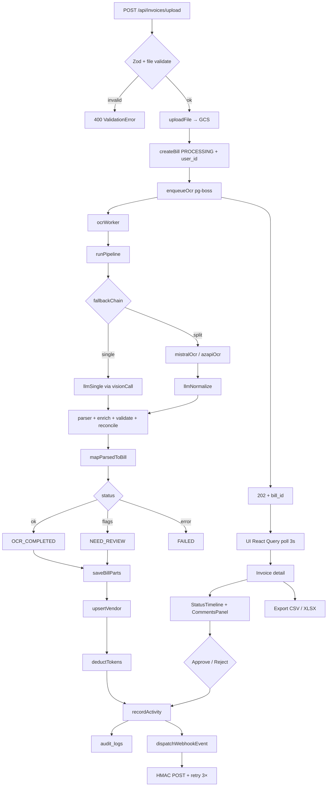

# OCR Flow — Upload to Webhook

End-to-end path from file upload through OCR processing, UI polling, approval, and export.

See also: [README.md](./README.md) (module internals), [../webhook/README.md](../webhook/README.md) (delivery + retry).

---

## Flow Overview

```
Upload PDF → validate → GCS → create bill (PROCESSING) → pg-boss queue
  → ocrWorker picks job → runPipeline() → fallbackChain
    → single mode: llmSingle (Gemini/Claude/OpenAI/Mistral via visionCall)
    → split mode: mistralOcr/azapiOcr → llmNormalize
  → parser: repair JSON → structureFromLlmResponse → coerceParsedInvoiceData
  → enrich: enrichParsedInvoice (vendor, date, vehicle, footer, totals)
  → validate: structural checks + review flags
  → reconcile: reconcileTotal (tolerance check, best attempt selection)
  → map: mapParsedToBill → update bill (COMPLETED/NEED_REVIEW/FAILED)
  → saveBillParts
  → upsertVendor
  → deductTokens
  → recordActivity (audit log + webhook dispatch)
    → webhook: POST to active endpoints with HMAC, retry 3× with exponential backoff
  → UI polls with React Query (refetchInterval 3s while PROCESSING)
  → User opens detail page → sees StatusTimeline, extracted fields, comments
  → Approve/Reject → audit + webhook
  → Export CSV/Excel
```

---

## Mermaid Diagram



---

## Stage Details

### 1. Upload & enqueue

| Step | Code | Notes |
|------|------|-------|
| HTTP handler | `ocr/route.ts` | Zod-validated multipart upload |
| Validate file | `shared/storage.ts` | PDF, JPEG, PNG, WebP |
| Store file | `shared/storage.ts` | Private GCS; signed URLs for read |
| Create bill | `ocr/repository.ts` | `ocr_status: PROCESSING`, `user_id` for isolation |
| Enqueue | `queue/ocrQueue.ts` | pg-boss `ocr-processing` queue; inline fallback in tests |

Returns **HTTP 202** immediately with `bill_id`. OCR does not block the request.

### 2. Worker & pipeline

| Step | Code | Notes |
|------|------|-------|
| Worker | `queue/ocrWorker.ts` | Concurrency 3; pg-boss retryLimit 3 |
| Pipeline entry | `ocr/process.ts` | Reads settings, builds fallback chain |
| Single mode | `pipeline/single.ts` → `providers/llmSingle.ts` | One vision LLM call via `providers/visionCall.ts` |
| Split mode | `pipeline/split.ts` | OCR → markdown → `llmNormalize` |
| Fallback | `pipeline/fallbackChain.ts` | Tries levels on API error or total mismatch |

### 3. Parse, enrich, validate

| Step | Code | Notes |
|------|------|-------|
| JSON repair | `parser/repair.ts` | Truncated braces, trailing commas |
| Structure | `parser/parser.ts` | `structureFromLlmResponse`, `coerceParsedInvoiceData` |
| Enrich | `transformer/normalize/` | vendor, date, vehicle, footer modules, totals |
| Validate | `transformer/validate.ts` | Structural checks |
| Review flags | `transformer/review.ts` | `NEED_REVIEW` codes |
| Reconcile | `transformer/reconcileTotal.ts` | Tolerance from `shared/ocrConstants.ts` |

### 4. Persist & side effects

| Step | Code | Notes |
|------|------|-------|
| Map to bill | `mapper.ts` | `mapParsedToBill` — `parsed_data` immutable |
| Update status | `ocr/repository.ts` | `OCR_COMPLETED`, `NEED_REVIEW`, or `FAILED` |
| Line items | `ocr/repository.ts` | `saveBillParts` |
| Vendor | `vendor/vendorService.ts` | Fire-and-forget upsert |
| Tokens | `users/service.ts` | Atomic debit + cost tracking |
| Activity | `ocr/service/recordActivity.ts` | Single helper: audit + webhook |

### 5. Webhooks

`recordActivity` → `dispatchWebhookEvent` → for each active subscribed endpoint:

1. Build signed JSON envelope
2. POST with `X-Webhook-Signature` (HMAC-SHA256)
3. Retry up to **3 attempts** with delays **0s, 10s, 30s**
4. Log each attempt in `webhook_deliveries`

See [../webhook/README.md](../webhook/README.md).

### 6. Frontend

| Step | Code | Notes |
|------|------|-------|
| List poll | `web/pages/InvoicesPage.tsx` | `@tanstack/react-query`, `refetchInterval: 3000` while any bill is `PROCESSING` |
| Detail | `web/pages/InvoiceDetailPage.tsx` | 14 sub-components in `components/invoice/` |
| Status UI | `StatusTimeline`, `StatusBadge` | Pipeline progress |
| Comments | `CommentsPanel` | `GET/POST /api/invoices/:id/comments` |
| Approve/Reject | `ApprovalBar` | Audit + webhook via `ocrLifecycle.ts` |
| Export | Invoices toolbar | CSV + `GET /api/invoices/export/xlsx` (exceljs) |

### 7. Data isolation

Regular users only see bills where `bills.user_id` matches their session. Admins see all bills. Filters (`minTotal`, `maxTotal`, `dateFrom`, `dateTo`, `vendor`) are applied server-side in `repository.ts`.

List pagination uses **cursor-based** paging (`cursor` = ISO timestamp of last row's `created_at`), not OFFSET.

---

## Status Reference

| Status | Meaning |
|--------|---------|
| `UPLOADED` | File stored, OCR not started |
| `PROCESSING` | Job queued or pipeline running |
| `OCR_COMPLETED` | Parsed, reconciliation OK |
| `NEED_REVIEW` | Parsed with review flags |
| `VERIFIED` | Human confirmed |
| `FAILED` | Pipeline or queue error |
| `DRAFT` | Email-ingested, waiting for Process OCR |

---

## Related API Endpoints

| Method | Path | When |
|--------|------|------|
| `POST` | `/api/invoices/upload` | Start flow |
| `GET` | `/api/invoices` | Poll list (cursor + filters) |
| `GET` | `/api/invoices/:id` | Detail view |
| `POST` | `/api/invoices/:id/approve` | Approve |
| `POST` | `/api/invoices/:id/reject` | Reject |
| `GET` | `/api/invoices/export/xlsx` | Excel export |
| `GET` | `/api/docs` | Public API reference |
